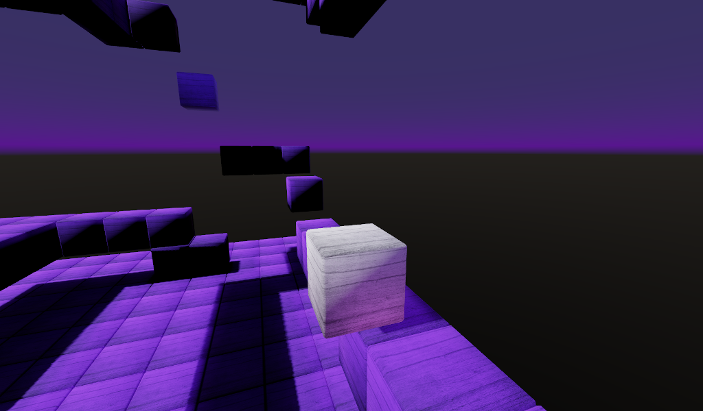
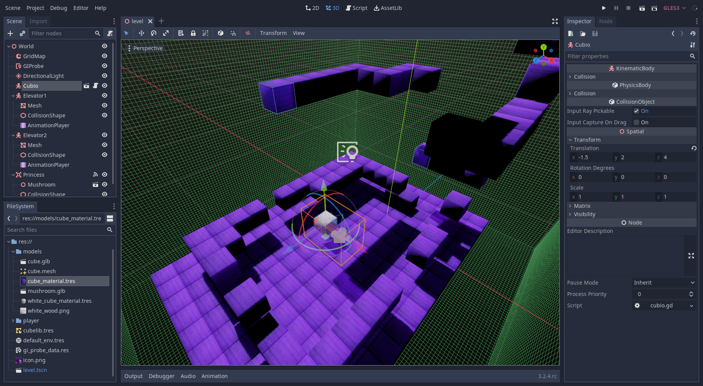

# Kinematic Character 3D

This is a project I started working on when I first used Godot and including a lot of tutorials and resources. This is for Launch Career in Compsci
Kinematic character demo for 3D using a cube for the character.
This is similar to the 3D platformer demo.

## Screenshots

